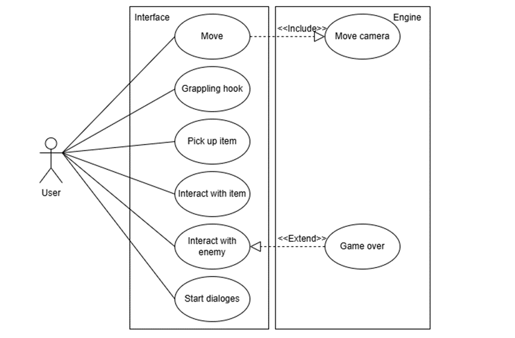
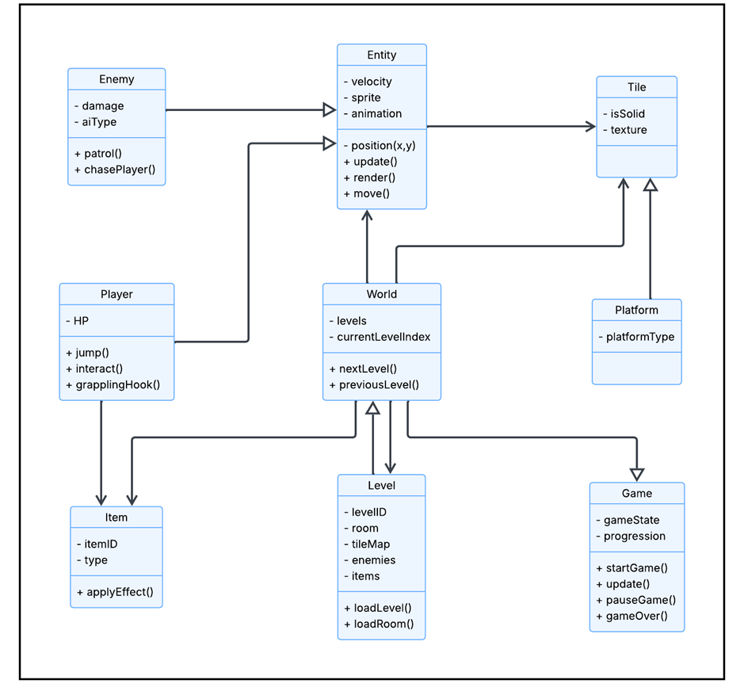
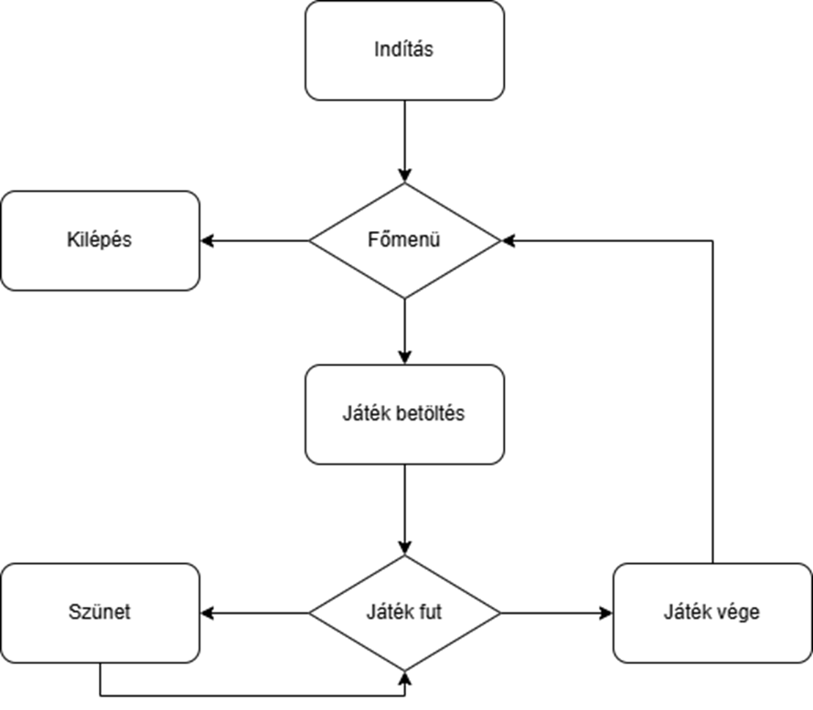
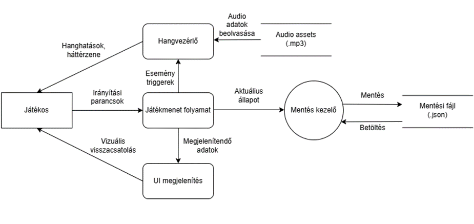
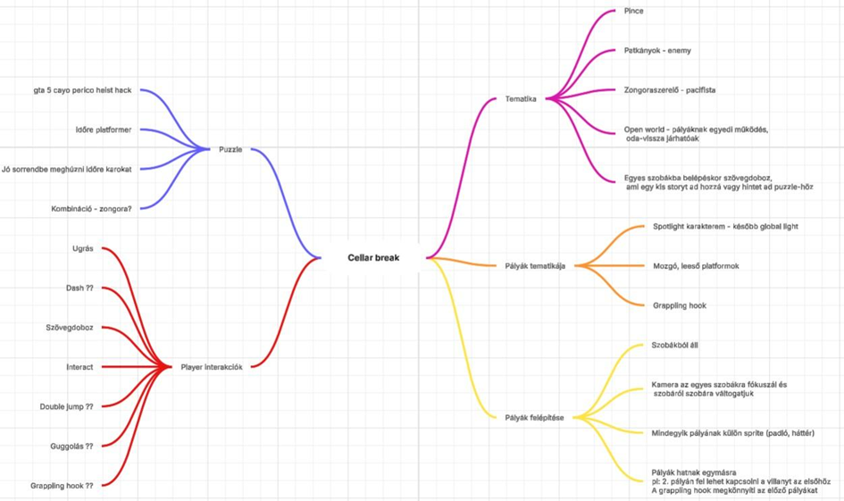

# TBD Entertainment – Játék Specifikáció

**Tantárgy:** Modern szoftverfejlesztési eszközök  
**Félév:** 2025-26/2  

**Készítette:**
- Gősi Krisztián  
- Molnár Ádám  
- Papp Csongor  
- Szabó Ármin  

---

# Történetvázlat

A főszereplő egy zongorahangoló, aki egy elhagyatott kúriába érkezik egy titokzatos megbízás miatt.  
Munka közben egy zongorabillentyű beesik a pincébe, és a játékos utána nyúlva maga is lezuhan.

A pincében magához térve rájön, hogy a hely nem hétköznapi:
- a tér torzult
- a kijárat eltűnt
- a helyszín labirintussá változott

A cél:
- az elveszett zongorabillentyűk összegyűjtése
- a pince mélyére jutás
- a végén egy dallam lejátszása a kijutáshoz

---

# Követelmények

| ID  | Megnevezés | Leírás | Prioritás |
|-----|------------|--------|----------|
| sz1 | Szobarendszer | A játék több pályából áll, amelyek különálló szobákból épülnek fel. | Magas |
| m1  | Mozgás | A játékos billentyűzettel tud mozogni és ugrani. | Magas |
| i1  | Interakció | A játékos interakcióba léphet a környezettel és objektumokkal. | Közepes |
| e1  | Mentés | A játék megőrzi a játékos előrehaladását pályák között. | Magas |
| e2  | Ellenfelek | Ellenségek jelennek meg, amelyek akadályozzák a játékost. | Közepes |
| v1  | Sprite-ok | Különböző grafikai elemek jelennek meg a játékban. | Alacsony |
| h1  | Hangok | A játék hangokat és zenét használ a hangulat fokozására. | Alacsony |

---

# Használati esetek

| Eset | Leírás | Prioritás |
|------|--------|----------|
| Move | A játékos mozgatása | Magas |
| Grappling hook | Speciális mozgási lehetőség | Közepes |
| Interact with item | Tárgyak felvétele, használata | Magas |
| Interact with enemies | Harc az ellenfelekkel | Magas |
| Dialog | Történeti elemek megjelenítése | Közepes |
| Save | Haladás mentése | Magas |
| Camera switch | Kamera váltás szobák között | Magas |
| Game Over | Játék vége halál esetén | Közepes |

---

# Struktúra

## Fő osztályok

### Game
A játék életciklusának kezelése:
- indítás
- frissítés
- szünet
- befejezés

### World
- pályák kezelése
- aktuális pálya betöltése

### Level
- egy adott pálya reprezentációja
- tile map + objektumok

### Entity
- minden mozgó objektum alapja

### Player
- játékos karakter
- mozgás, ugrás, interakció

### Enemy
- ellenségek
- AI viselkedés (járőrözés, üldözés)

### Tile
- pálya elemek
- járható / nem járható felületek

### Platform
- speciális tile (mozgó, leeső)

### Item
- felvehető tárgyak
- hatások alkalmazása

---

# Osztálykapcsolatok

- **Öröklés:**
  - Player → Entity
  - Enemy → Entity
  - Platform → Tile

- **Hierarchia:**
  - Game → World → Level

- **Kapcsolatok:**
  - Player ↔ Item
  - Entity ↔ Tile
  - World → összes objektum

---

# Viselkedés

## Állapotok

### Játékos
- Idle
- Run
- Jump
- Fall
- Grapple
- Take Damage
- Dead

### Ellenfelek
- Idle
- Patrol
- Chase
- Attack

---

# Játék működés

## Fő állapotok
1. Indítás
2. Főmenü
3. Betöltés
4. Játék fut
5. Szünet
6. Játék vége

---

# Kamera működése

- Szoba-alapú kamera
- Nem követ folyamatosan
- Szobaváltáskor ugrik új pozícióba

---

# Pálya és adatkezelés

## Felépítés
- Grid rendszer
- Tilemap rétegek:
  - Ground
  - Background
  - Decoration

## Fizika
- Rigidbody2D
- Collider komponensek

## Objektumok
- Enemy prefab
- Platform prefab
- Item prefab

## Betöltés
- Scene alapú
- Nincs külső mentés
- Reset induláskor

---

# Adatfolyam

---

# Mindmap

---